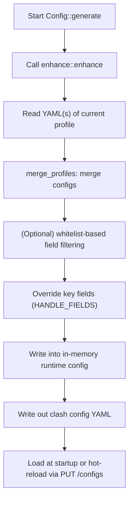

# Explanation of Chimera’s Runtime Configuration Generation Mechanism

## 1. Key Takeaways

The configuration consumed by the core (e.g., `chimera_client` / `mihomo`) at startup and during hot-reload is **not** read directly from `profiles.yaml`.
What the core actually uses is a runtime file:

* `clash-config.yaml` (runtime configuration, located under `app_config_dir`)

This file is first composed in memory by the backend, then written to disk, and finally passed to the core either via **startup arguments** or **Clash API hot-reload**.

## 2. Configuration Inputs (Raw Materials)

The runtime configuration is built from four categories of inputs:

1. Application settings: `chimera-config.yaml`

   * Struct: `IVerge`
   * Load entry: `backend/tauri/src/config/chimera/mod.rs` → `IVerge::new()`
   * Purpose: controls field filtering, port strategy, TUN/system proxy behavior, etc.

2. Clash Guard override template: `clash-guard-overrides.yaml`

   * Struct: `IClashTemp`
   * Load entry: `backend/tauri/src/config/clash/mod.rs` → `IClashTemp::new()`
   * Purpose: forcibly overrides critical fields (e.g., `mode`, `mixed-port`, `external-controller`, `secret`, etc.)

3. Profile metadata: `profiles.yaml`

   * Struct: `Profiles`
   * Load entry: `backend/tauri/src/config/profile/profiles.rs` → `Profiles::new()`
   * Purpose: records the currently active profile (`current`) and the profile list (`items`)

4. Concrete profile content files: `app_config_dir/profiles/*.yaml`

   * Load entry: `Profiles::current_mappings()`
   * Purpose: provides actual configuration content such as proxies, rules, DNS, TUN, etc.

## 3. Startup Initialization Phase

### 3.1 Creating Base Files (If Missing)

`backend/tauri/src/utils/init/mod.rs` → `init_config()` ensures the following files exist:

* `clash-guard-overrides.yaml` (generated by default via `IClashTemp::template()`)
* `chimera-config.yaml` (generated by default via `IVerge::template()`)
* `profiles.yaml` (an empty/default configuration)

### 3.2 Loading Global Configuration Objects

`backend/tauri/src/config/core.rs` → `Config::global()` initializes:

* `Profiles::new()`
* `IVerge::new()`
* `IClashTemp::new()`
* `IRuntime::new()`

`IRuntime` is the in-memory runtime configuration container; its `config` field is an `Option<Mapping>`.

## 4. Main Runtime Configuration Composition Flow

Main entry: `Config::generate()` (`backend/tauri/src/config/core.rs`)

### 4.1 What `enhance::enhance()` Does

Location: `backend/tauri/src/enhance/mod.rs`

Core steps:

1. Load Clash Guard configuration

   * `let clash_config = Config::clash().latest().0.clone()`

2. Read current feature toggles/settings

   * such as `enable_clash_fields`, from `IVerge`

3. Load the content of the currently active profile(s)

   * via `Profiles::current_mappings()`
   * this method iterates over `current`, reads `profiles/<file>.yaml` one by one, and converts them into `Mapping`

4. (Reserved) Execute profile chain scripts

   * calls `process_chain(...)`
   * current implementation is a placeholder (no-op), returning the original config

5. Merge multiple profile configurations

   * calls `merge_profiles(...)`
   * current strategy:

     * first config: full `extend`
     * subsequent configs: only append `proxies` to the existing `proxies`

6. Whitelist field filtering (optional, controlled by a toggle)

   * `use_whitelist_fields_filter(...)`
   * when `enable_clash_fields = true`, only retains keys in `valid + default fields`

7. Force-override Guard fields

   * writes back fields listed in `HANDLE_FIELDS` from `IClashTemp` into the final config
   * ensures critical control fields are centrally managed by the client

### 4.2 Scope of `HANDLE_FIELDS` Overrides

Defined in `backend/tauri/src/enhance/field.rs`:

* `mode`
* `port`
* `socks-port`
* `mixed-port`
* `allow-lan`
* `log-level`
* `ipv6`
* `secret`
* `external-controller`

This means that even if these fields exist in a profile, the final values will be overwritten by the corresponding values from `clash-guard-overrides.yaml`.

## 5. Writing to Disk and File Locations

Entry: `Config::generate_file(ConfigType::Run)` (`backend/tauri/src/config/core.rs`)

* Output in `Run` mode: `app_config_dir()/clash-config.yaml`
* Output in `Check` mode: `temp_dir()/clash-config-check.yaml`

If generation fails, `Config::init_config()` provides a fallback: it writes `IClashTemp` directly as the runtime configuration.

## 6. How the Core Obtains This Configuration

### 6.1 Loaded at Startup

`CoreManager::run_core()` → `Instance::try_new()` (`backend/tauri/src/core/clash/core.rs`):

1. Calls `Config::generate_file(ConfigType::Run)` to get the path
2. Passes the path to the core process via `CoreInstanceBuilder.config_path(config_path)`

In other words: the core reads `clash-config.yaml` directly at startup.

### 6.2 Hot-Reload During Runtime

`CoreManager::update_config()` flow:

1. `Config::generate().await?` recomposes the in-memory config
2. `check_config().await?` validates syntax/usability using the check file
3. `generate_file(Run)` rewrites `clash-config.yaml`
4. Calls `PUT /configs` with body `{ "path": "<absolute path>" }` to instruct the core to reload

Relevant code:

* `backend/tauri/src/core/clash/core.rs` → `update_config()`
* `backend/tauri/src/core/clash/api.rs` → `put_configs(...)`

## 7. User Actions That Trigger a Rebuild

### 7.1 Switching/Modifying Profile Selection

Frontend `commands.patchProfilesConfig` → backend `patch_profiles_config(...)`:

1. Apply draft: `Config::profiles().draft().apply(...)`
2. Trigger `CoreManager::update_config()`
3. On success: `Config::profiles().apply()` + `save_file()`
4. On failure: `discard()` (rollback)

### 7.2 Changing Settings (Certain Fields)

Frontend `commands.patchVergeConfig` → backend `feat::patch_verge(...)`:

* Writes an `IVerge` draft first
* Some fields (e.g., `enable_tun_mode`) may trigger:

  * `Config::generate()` + `run_core()` (restart scenario)
  * or `update_core_config()` (hot-update scenario)

### 7.3 Importing the First Profile

After `import_profile(...)` succeeds, if there is no active profile yet, it automatically constructs `ProfilesBuilder.current = [new_uid]` and reuses `patch_profiles_config(...)` to trigger an update.

## 8. Key Details and Common Misunderstandings

1. `profiles.yaml` is **not** the final configuration used by the core

   * it only stores profile metadata and the `current` pointer

2. Profile content files are **not** passed to the core verbatim

   * they become the runtime config only after merging, filtering, and guard overrides

3. `external-controller` may have its port changed before startup

   * `prepare_external_controller_port()` checks port availability according to policy and switches ports if necessary

4. `verge_mixed_port` is primarily used for system proxy logic

   * it is **not** directly written to the runtime YAML’s `mixed-port`
   * system proxy uses `verge_mixed_port` first, otherwise falls back to `Config::clash().get_mixed_port()`

5. `get_runtime_yaml()` returns `IRuntime.config` from memory

   * it is usually consistent with the recently written `clash-config.yaml`
   * but fundamentally it comes from memory, not from re-reading disk each time

## 9. Current Implementation Limitations (As of the Codebase)

1. Chain script execution is currently a placeholder

   * `process_chain(...)` does not actually rewrite the config yet

2. Global chain processing code is still commented out

   * only the scoped chain framework exists for now

3. `patch_clash_config` IPC is still `todo!()`

   * the frontend will fail if it uses that IPC path

4. Directly editing a profile file does not automatically trigger a hot-reload

   * `save_profile_file(...)` only writes the file; it does not call `update_config()`

## 10. Troubleshooting Checklist (Practical Order)

If you suspect “the core is using the wrong configuration,” check in this order:

1. Confirm the active profile is correct

   * verify `profiles.yaml` → `current`

2. Confirm the profile source content matches expectations

   * check `app_config_dir/profiles/*.yaml`

3. Check guard override items

   * verify whether `HANDLE_FIELDS` in `clash-guard-overrides.yaml` overrides the values you intended

4. Inspect the final runtime configuration

   * check `clash-config.yaml`
   * or call `get_runtime_yaml()` to view the in-memory version

5. Confirm a hot-reload actually occurred

   * verify `patch_profiles_config` / `patch_verge_config` / `restart_sidecar` was executed
   * check logs to see whether `PUT /configs` succeeded

6. If you see port-related issues

   * check whether `external-controller` was rewritten by the port strategy

