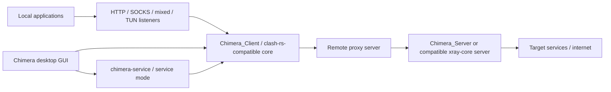

# System Topology

The current workspace is organized around a client GUI, a client core, and a
server core. The pieces are related, but they are not one shared runtime:

## Component Roles

The implementation references below point to companion project repositories in
the broader Chimera workspace; they are not paths inside this Wiki repository.

| Component        | Runtime role                                                                                                                                                                                                   | Implementation references                                                               |
| ---------------- | -------------------------------------------------------------------------------------------------------------------------------------------------------------------------------------------------------------- | --------------------------------------------------------------------------------------- |
| `Chimera`        | Desktop control surface. It imports profiles, selects and updates proxy cores, generates runtime config, manages system proxy state, and can start the core either as a child process or through service mode. | `Chimera/README.md`, `backend/tauri/src/lib.rs`, `backend/tauri/src/core/clash/core.rs` |
| `Chimera_Client` | Clash-family client core. It parses Clash-style YAML, starts inbound listeners, resolves DNS, applies rules, dials outbound proxies, exposes REST APIs, and supports hot reload.                               | `Chimera_Client/README.md`, `clash-lib/src/config/def.rs`, `clash-lib/src/app/*`        |
| `Chimera_Server` | xray-core-compatible server core, currently centered on inbound parsing and inbound protocol behavior.                                                                                                         | `Chimera_Server/README.md`, `chimera_server_app`, `chimera_server_lib`                  |

## Traffic Flow

1. Applications enter the client through local HTTP, SOCKS, mixed, TUN, redir,
   or TProxy listeners, depending on enabled features and platform support.
2. `Chimera_Client` classifies each flow with its rule engine and DNS resolver.
3. The selected outbound protocol establishes the remote connection.
4. On the server side, `Chimera_Server` can terminate supported inbound
   protocols and forward traffic according to the configured server behavior.

## Control Flow

`Chimera` does not terminate remote proxy protocols itself. It manages the local
core lifecycle and runtime files:

- profile files live under the app profile/config directories,
- `profiles.yaml` tracks profile metadata,
- a generated runtime YAML is passed to the selected core,
- service mode moves core lifecycle into `chimera-service` while the GUI remains
  the control surface.
