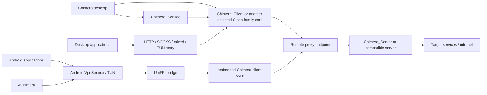

# System Topology

The Chimera ecosystem is split across multiple repositories with different
runtime responsibilities. The desktop application, Android application, client
core, privileged service, and server core are related, but they are not one
shared process.

## Ecosystem Overview



The desktop and Android paths are sibling client applications. They normally do
not sit in series.

## Component Responsibilities

| Component | Runtime role | Primary source anchors |
| --- | --- | --- |
| `Chimera` | Desktop control plane: profile/runtime generation, core selection and update, foreground process management, service-mode IPC, system integration. | `backend/tauri/src/config`, `backend/tauri/src/core/clash`, `backend/tauri/src/core/service` |
| `Chimera_Client` | Clash-family client core: local listeners, DNS, rules, TUN/transparent paths, outbound proxy handlers, controller APIs. | `clash-lib/src/config`, `clash-lib/src/app`, `clash-lib/src/proxy` |
| `Chimera_Service` | Privileged local service: install/start/stop/status, local IPC, selected core lifecycle, selected privileged network operations. | `chimera_ipc/src/api`, `chimera_service/src/server`, `chimera_service/src/cmds` |
| `AChimera` | Android control/platform layer: `VpnService`, TUN ownership, profile lifecycle, UniFFI bridge, controller-backed traffic/memory/connection UI. | `app/src/main/java/rs/chimera/android/backend`, `service/TunService.kt`, `ffi` |
| `Chimera_Server` | Server/inbound core: Xray-oriented config validation, listeners/transports/security wrappers, inbound protocol handlers, forwarding/runtime/traffic state. | `chimera_server_lib/src/config`, `beginning`, `handler`, `reality` |

For a source-audited feature matrix, see
[Implementation Status and Source Evidence](./implementation-status.md).

## Desktop Data Flow

A typical desktop forwarding path is:

```text
application
    |
    v
HTTP / SOCKS / mixed / TUN / transparent entry
    |
    v
Chimera_Client
    |
    +--> DNS resolution / Fake-IP handling
    +--> rule evaluation
    +--> outbound selection
    |
    v
proxy protocol + optional transport/security layers
    |
    v
Chimera_Server or another compatible server
    |
    v
target
```

`Chimera` does not terminate the remote proxy protocol itself. It prepares and
controls the selected core.

## Desktop Control Flow

The control path is separate from packet forwarding:

```text
profile / application settings
        |
        v
Chimera config + enhance pipeline
        |
        v
generated runtime config
        |
        +-----------------------+
        |                       |
        v                       v
foreground child          Chimera_Service
        |                       |
        +-----------+-----------+
                    v
              selected core
```

The desktop source currently supports multiple Clash-family core types,
including Chimera Client. The generated configuration and selected core type are
therefore separate compatibility dimensions: a field can exist in the generated
YAML even when a selected core handles it differently.

## Android Data and Control Flow

Android has an additional OS VPN boundary:

```text
application traffic
       |
       v
Android VpnService / TUN
       |
       v
AChimera TunService
       |
       v
UniFFI
       |
       v
embedded Rust client core
       |
       +--> protect(remote socket fd)
       |
       v
physical network / remote proxy
```

The `protect(fd)` callback is essential because the proxy core's own remote
sockets must bypass the VPN capture path rather than re-entering the TUN.

See [AChimera Android Client](./achimera.md) for the lifecycle details.

## Server Inbound Flow

A useful Server mental model is:

```text
listen socket / UDP / QUIC
        |
        v
transport acceptance
        |
        +--> WebSocket / XHTTP / gRPC / HTTPUpgrade
        |
        v
TLS / REALITY where configured
        |
        v
inbound proxy handler
        |
        v
outbound/session forwarding
```

Transport success and inner-protocol success are separate states. For example,
a REALITY handshake can succeed while VLESS authentication or request parsing
still fails afterward.

## Configuration Ownership

Keep these ownership boundaries explicit in documentation:

- `Chimera` owns desktop application settings, profile orchestration, generated
  runtime config, and core lifecycle decisions.
- `Chimera_Service` owns privileged service/process management, not proxy-rule
  semantics.
- `AChimera` owns Android VPN/profile/UI concerns; the embedded core owns proxy
  forwarding semantics.
- `Chimera_Client` owns Clash-style client runtime behavior.
- `Chimera_Server` owns server inbound/runtime behavior.

A bug should be assigned to the layer that actually owns the failing state,
rather than to the repository whose UI happens to expose it.
